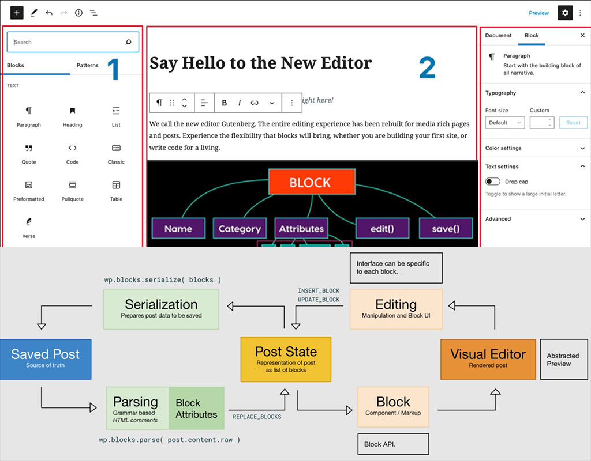

# DP Blocks
DP Block Plugin - Gutenberg / Bootstrap blocks

### DP BASE BLOCKS:
- **DP Row/Section & Columns Bootstrap**
- **DP CTA Media and Text**
- **DP Button | Bootstrap**
- **DP ACF Field**
- **DP Card**
---
- **DP Event Details**
- **DP Pre Header**
- **DP Price Card**
- **DP Soc Share**
- **DP CountUp**
- **DP Video**
---
### DP WP CUSTOMIZED BLOCKS:
- **WP Table | JS library: https://datatables.net |R** 
- **WP Tag Cloud | styling & JS**
- **WP Gallery | styling & JS**
- **WP Quote | styling**
- **WP Cover | styling**
- **WP Audio | styling**
- **WP File | styling**
- **WP List | styling**
---
### DP Theme BLOCKS:
- **ACF Fexbox (Tabs, Accordion, Portfolio,  Related Pages & Posts, Gallery)**
- **ACF Theme Options (Google Map, Testimonials)**
- **DP Forms - ACF or F7 Patterns + Options |R**
---
### DEVELOPERS
#### DEMO (import XML): inc/demo-dp-wp-blocks.xml

***For block build***

- **yarn public (1x) - buld & minify style & blocks**
---
- **yarn start (watch) - edit blocks**
- **yarn start:style (watch) - edit blocks admin & front style**
---
- **WordPress Icons Library: https://wordpress.github.io/gutenberg/?path=/story/icons-icon--library**
- **WP Block Development: https://css-tricks.com/getting-started-with-wordpress-block-development/**

